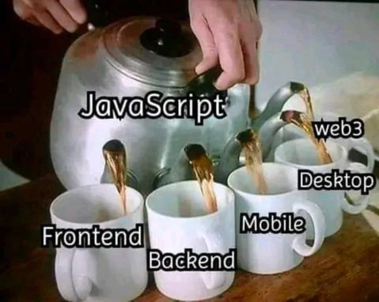

Sebelum kita menjelajahi dunia Node JS lebih jauh, mari kita awali petualangan kita kali ini dengan berkenalan dengan teknologi Node JS terlebih dahulu. Teknologi Node JS pertama kali diperkenalkan oleh Ryan Dahl sekitar tahun 2009, dengan menggunakan Node JS kita bisa menjalankan atau mengeksekusi kode JavaScript di luar environmentnya, dalam hal ini adalah browser. Node JS sendiri dibuat dengan menggunakan engine bernama v8. Engine v8 ini merupakan engine yang digunakan dalam browser Google Chrome, cara kerja engine ini adalah dengan mengubah kode JavaScript menjadi bentuk byte-byte code, sehingga eksekusi atau runtime execution dari JavaScript menjadi lebih cepat. Perlu diperhatikan bahwa Node JS ini bukanlah bahasa pemrograman, melainkan runtime environment. 

### Kenapa harus Node JS?

Ketika kita mempelajari sesuatu, pastilah kita akan awali dengan mengapa atau kenapa, dari hal ini maka nanti kita akan melihat sudut pandang dan perspektif yang beraneka ragam, sehingga proses belajar kita akan menjadi lebih efektif. So balik lagi, mengapa harus Node JS? Mungkin anda pernah melihat postingan meme berikut?

Pada meme di atas, terlihat Javascript bisa mengisi di hampir semua lini, misalkan front end, back end, mobile apps, dekstop app dan machine learning. Artinya apa? JavaScript everywhere, JavaScript ada di mana-mana. Nah konsep JavaScript everywhere inilah yang tidak mungkin bisa kita pisahkan dengan Node JS, dengan Node JS maka istilah JavaScript everywhere menjadi semakin populer, karena pada zaman dulu JavaScript hanya sebatas pada sisi client, namun dengan hadirnya teknologi Node JavaScript, Kini JavaScript dapat berjalan diluar browser, seperti yang sudah kita simak di meme tersebut. 

### Apa saja yang tidak bisa dilakukan Node JS?

Walaupun dengan hadirnya teknologi Node JS, tidak serta merta kita dapat menggunakannya disegala environment untuk menjalankan kode dan fitur yang tersedia pada JavaScript. Misalkan kita ingin menjalankan fitur pada JavaScript client (Document Object Model) di Node JS, maka tentu saja hal ini tidak bisa dilakukan.

