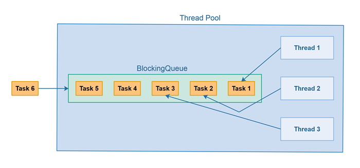

Pada materi Concurrency dan parallel kita sudah mengetahui bahwa thread merupakan proses ringan yang biasa dibuat saat membuat applikasi. Walaupun ada istilah "ringan", namun jika kita terlalu banyak membuat thread (thread overload), maka tetap saja akan memberatkan proses kita. Oleh karena itu, kita harus melakukan management terhadap thread-thread tersebut, dengan apa? Kita bisa menggunakan threadpool. Threadpool merupakan tempat dimana kita menyimpan thread, jadi ketika kita membutuhkan thread maka kita cukup ambil dari threadpool, dengan adanya threadpool ini kita bisa menggunakan thread berulang kali tanpa harus membuat thread baru terus menerus atau istilahnya reusable thread.

### Threadpool Queue

Apa yang akan terjadi ketika semua thread sedang bekerja? Bagaimana jika kita ingin meminta thread ke threadpool untuk mengerjakan sesuatu? Jika semua thread penuh, kita tidak bisa meminta lagi thread ke threadpool. Kita harus menunggu sampai ada thread yang tidak sibuk. Dimana kita harus menunggu sampai ada thread tersedia untuk digunakan? Biasanya threadpool memiliki tempat untuk menyimpan tugas yang belum dikerjakan oleh thread
di tempat bernama queue (antrian). Ketika kita mengirim perintah ke threadpool, perintah tersebut akan dikirim ke queue, lalu perintah-perintah itu akan dieksekusi satu per satu oleh thread yang tersedia di threadpool

### Threadpool Web Model

Dahulu pembuatan web application sangat populer menggunakan threadpool model. Setiap request yang masuk ke web server akan diproses oleh satu buah thread. Dengan demikian ketika banyak request masuk, semua bisa diproses secara paralel karena akan ditangani oleh thread masing-masing. Namun penggunaan threadpool model ini memiliki kekurangan, ketika thread sedang sibuk semua, secara otomatis request selanjutnya harus menunggu sampai ada thread yang selesai melakukan tugas sebelumnya. Contoh web server yang menggunakan threadpool model, seperti Apache HTTPD, Apache Tomcat dan lain-lain

[<<Concurreny dan Parallel](https://github.com/Bahrul-Rozak/mastering-node-js/tree/main/node-js-dasar/03-Concurrency-dan-Parallel)
 
[Blocking dan Non Blocking>>]()
