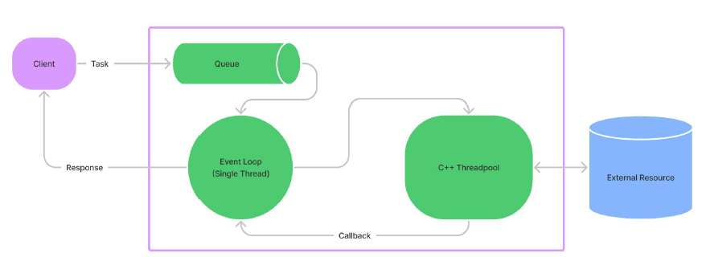

Event-Loop merupakan single thread proses yang digunakan untuk mengeksekusi kode Non-Blocking. Karena Event-Loop hanya menggunakan single thread, maka kita harus berhati-hati ketika
membuat blocking code, karena bisa memperlambat proses eksekusi kode kita. Event-Loop sendiri sebenarnya tugasnya hanya menerima dan mengirim eksekusi kode ke C++ threadpool, oleh karena itu selalu usahakan menggunakan kode nonblocking agar proses blocking-nya dikerjakan di C++ threadpool. Event-Loop akan menerima response dari C++ threadpool yang di kirim via callback. NodeJS Menggunakan C++ Threadpool untuk workernya, yaitu threadpool untuk melakukan pekerjaan.

Libuv adalah library yang digunakan di NodeJS, dimana secara default libuv menggunakan 4 thread di dalam threadpool nya, hal ini menjadikan kita bisa melakukan 4 pekerjaan blocking sekaligus dalam satu waktu.
Jika terlalu banyak pekerjaan blocking, kita bisa mengubah jumlah thread di libuv dengan
pengaturan environment variable UV_THREADPOOL_SIZE

[<<Blocking dan Non Blocking](https://github.com/Bahrul-Rozak/mastering-node-js/tree/main/node-js-dasar/05-Blocking-dan-Non-Blocking)
 
[Menginstall Node JS>>]()
