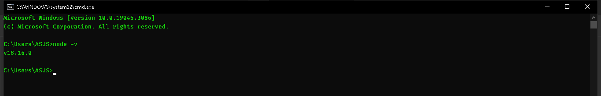
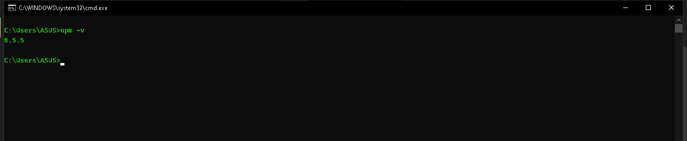

<p align="justify">
Silahkan kunjungi https://nodejs.org/en untuk mendownload Node JS. Kemudian download yang versi LTS. Setelah itu untuk memastikan bahwa Node JS sudah terinstall di local environment kita, kita bisa check menggunakan perintah
</p>

```
node -v
```



Ketika, kita menginstall Node JS, secara default Node JS sudah membundle packet manager bernama NPM, untuk mengecek NPM bisa menggunakan perintah

```
npm -v
```



[<<Node JS Architecture](https://github.com/Bahrul-Rozak/mastering-node-js/tree/main/node-js-dasar/06-Node-JS-Architecture)
<br>
[Hello World>>]()
