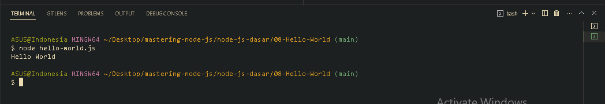

<p align="justify">
Silahkan buat satu buah folder bernama belajar-node-js, kemudian buatlah satu buah file bernama hello-world.js, yang didalamnya tentu saja kita masukkan script javascript untuk menampilkan hello world di dalam console.
</p>

```js
console.log("Hello World");
```

<p align="justify">
Karena NodeJS tidak memerlukan Web Browser, jadi kita bisa langsung menjalankan program
JavaScript kita menggunakan aplikasi NodeJS lewat terminal / command promt, dengan perintah 
</p>

```
node namaFilenya
```



[<<Menginstall Node JS](https://github.com/Bahrul-Rozak/mastering-node-js/tree/main/node-js-dasar/07-Menginstall-Node-JS)
<br>
[Node JS REPL>>]()
