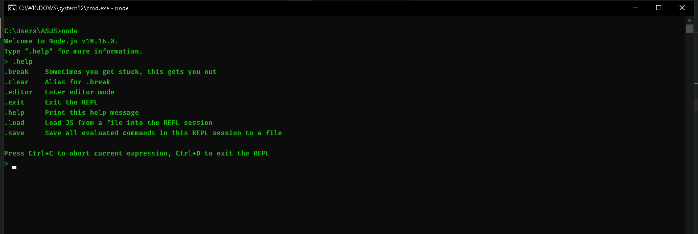

Sebenarnya, kita bisa saja menjalankan kode JavaScript, tanpa harus membuat filenya. Caranya yaitu dengan menggunakan playground Node JS bernama REPL. REPL ini merupakan kepanjangan dari Read Eval Print Loop, yang merupakan mekanisme membaca langsung kode program yang diketikkan, lalu mengeksekusinya, menampilkan hasilnya, lalu mengulangi dari awal lagi. Untuk menggunakan playground REPL caranya cukup ketikkan perintah node

[<<Hello World](https://github.com/Bahrul-Rozak/mastering-node-js/tree/main/node-js-dasar/08-Hello-World)
 
[Node JS Standard Library>>]()
