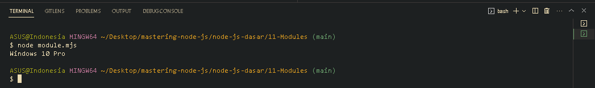

<p align="justify">
Nah standard library pada Node JS, ini kita sebut dia sebagai Modules, jika anda sudah paham menggunakan JavaScript modules, ya seperti itu kurang lebih mekanisme kerjanya. Jika kita ingin menggunakan Modules, maka kita juga perlu memberi tahu bahwa file JavaScript kita menggunakan Modules, caranya dengan mengubah nama file extensi .js (javascipt) menjadi extensi .mjs (module javascript). Sebagai contoh disini kita memiliki file module.mjs yang dimana pada file tersebut memiliki fungsi untuk mengecek versi dari os kita, nah untuk memudahkan kita bisa menggunakan standard library bernama os.
</p>

```js
import os from "os";

function getOsInformation() {
  const version = os.version();
  console.log(version);
}
getOsInformation();
```



[<<Node JS Standard Library](https://github.com/Bahrul-Rozak/mastering-node-js/tree/main/node-js-dasar/10-Node-JS-Standard-Library)
<br>
[Require Functions>>]()
