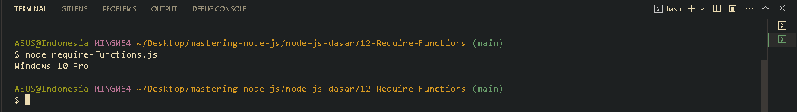

<p align="justify">
Ketika kita menggunakan JavaScript modules, untuk melakukan import file kita bisa gunakan cara import blabla from blabla, namun itu sekarang. Tapi dahulu kala, ketika awal mula teknologi Node JS rilis, Node JS secara default tidak bisa menggunakan JavaScript modules dengan cara tersebut, tapi Node JS menggunakan require functions, walaupun require functions mulai ditinggalkan tapi masih banyak beberapa artikel atau tutorial yang menggunakan require function, oleh karena itu tidak ada salahnya untuk mempelajari require function. Menggunakan require functions itu sangat sederhana kita cukup ketikkan keyword require(). Sebagai contoh kita memiliki functions untuk mengecek versi os menggunakan standard library os
</p>

```js
const os = require("os");

function getOsInformation() {
  const version = os.version();
  console.log(version);
}
getOsInformation();
```



[<<Modules](https://github.com/Bahrul-Rozak/mastering-node-js/tree/main/node-js-dasar/11-Modules)
<br>
[Globals Async pada Modules>>]()
