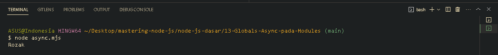

<p align="justify">
Ketika kita menggunakan async await, biasanya kita perlu membuat terlebih dahulu function dengan label async, nah saat kita menggunakan javascript modules (.mjs), itu secara tidak langsung, global codenya adalah bersifat async. Oleh karena itu kita bisa menggunakan async await, kecuali jika kita membuat function, maka function tersebut harus kita berikan label sebagai async jika ingin menggunakan async await.
</p>

```js
function samplePromise() {
  return Promise.resolve("Rozak");
}

const data = await samplePromise();
console.log(data);
```



[<<Require Functions](https://github.com/Bahrul-Rozak/mastering-node-js/tree/main/node-js-dasar/12-Require-Functions)
<br>
[OS>>]()
