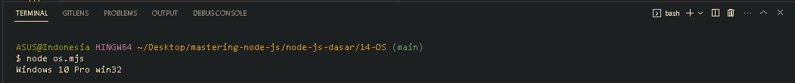

<p align="justify">
Pada beberapa materi sebelumnya, kita sudah menggunakan standar library bernama OS, OS merupakan standard library yang digunakan untuk mendapatkan informasi tentang sistem operasi.
</p>

```js
import os from "os";

const getOsInformation = {
  version: os.version(),
  platform: os.platform(),
};

let { version, platform } = getOsInformation;

console.log(version, platform);
```



[<<Globals Async pada Modules](https://github.com/Bahrul-Rozak/mastering-node-js/tree/main/node-js-dasar/13-Globals-Async-pada-Modules)
<br>
[Path>>]()
