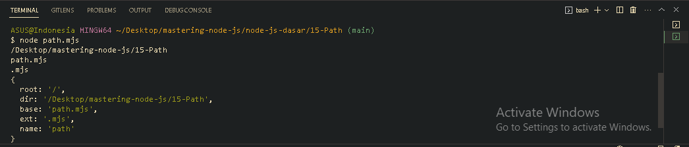

<p align="justify">
Path merupakan standard library yang digunakan untuk mendapatkan lokasi file
</p>

```js
import path from "path";

const locationFile = "/Desktop/mastering-node-js/15-Path/path.mjs";

console.log(path.dirname(locationFile));
console.log(path.basename(locationFile));
console.log(path.extname(locationFile));
console.log(path.parse(locationFile));
```



[<<OS](https://github.com/Bahrul-Rozak/mastering-node-js/tree/main/node-js-dasar/14-OS)
<br>
[File System>>]()
