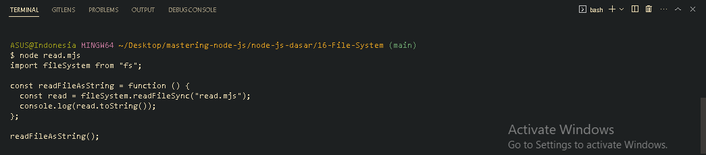
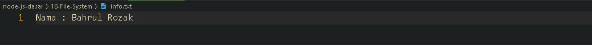

<p align="justify">
Di Node JS, kita juga bisa melakukan operasi manipulasi file, contoh manipulasi file sederhana adalah membaca dan menulis file. Pada teknologi Node JS kita bisa menggunakan standard library bernama fs alias file system. Dalam fs terdapat 3 jenis library yaitu, yang pertama library yang bersifat blocking atau synchronous, yang kedua library yang bersifat non-blocking atau asynchronous menggunakan callback dan yanh ketiga library yang bersifat non-blocking atau asynchronous tapi menggunakan promise
</p>

<p align="justify">
Disini kita mempunyai sebuah fungsi untuk membaca isi file pada file read.mjs dalam bentuk string
</p>

```js
import fileSystem from "fs";

const readFileAsString = function () {
  const read = fileSystem.readFileSync("read.mjs");
  console.log(read.toString());
};

readFileAsString();
```



<p align="justify">
Kemudian kita juga, membuat sebuah fungsi untuk menuliskan file dalam format info.txt yang berisi data diri nama : Bahrul Rozak
</p>

```js
import fileSystem from "fs";

const writeFileTxt = function () {
  const write = fileSystem.writeFileSync("info.txt", "Nama : Bahrul Rozak");
  console.log(write);
};

writeFileTxt();
```

Hasilnya, kita telah membuat satu file info.txt



[<<Path](https://github.com/Bahrul-Rozak/mastering-node-js/tree/main/node-js-dasar/15-Path)
<br>
[Debugger>>]()
