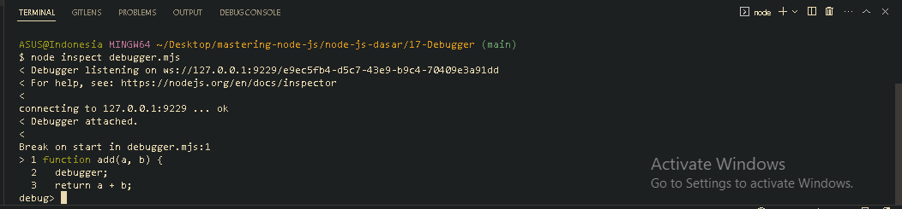

<p align="justify">
Debugging merupakan makanan sehari-hari bagi para developer, Nah Node JS sendiri menyediakan fitur untuk melakukan debugging tersebut. Dia bernama debugger. Dalam debugging, ada istilah yang cukup penting untuk kita pahami yaitu, breakpoint. Breakpoint adalah lokasi dimana kita ingin menghentikan
sementara eksekusi kode program. Biasanya hal ini  kita lakukan untuk mengawasi data-data di sekitar lokasi berhentinya tersebut. Untuk menambahkan breakpoint, kita bisa menggunakan keyword debugger
</p>

```js
function add(a, b) {
  debugger;
  return a + b;
}

const calculate = add(5, 5);
console.log(calculate);
```

<p align="justify">
Untuk menjalankan mode debugger, kita bisa menggunakan perintah node inspect namafile
</p>



[<<File System](https://github.com/Bahrul-Rozak/mastering-node-js/tree/main/node-js-dasar/16-File-System)
<br>
[DNS>>]()
