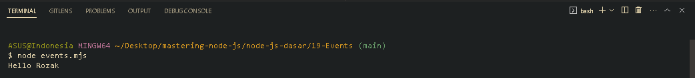

<p align="justify">
Untuk mengimplementasikan event listener pada teknologi Node JS, kita dapat menggunakan salah satu standard library bernama Events. Nah Di dalam Events ini, terdapat sebuah class bernama EventEmitter yang bisa digunakan sebagai wadah atau penampung untuk  data listener per jenis event. Lalu kita bisa melakukan emmit untuk mentrigger jenis event dan mengirim data kepada event tersebut. 
</p>

```js
import { EventEmitter } from "events";

const emitter = new EventEmitter();
emitter.addListener("hello", (name) => {
  console.info(`Hello ${name}`);
});

emitter.emit("hello", "Rozak");
```

<p align="justify">
Ketika kita memberikan dan mengirimkan trigger "hello" dan "Rozak", maka Hello Rozak akan berjalan
</p>



[<< DNS](https://github.com/Bahrul-Rozak/mastering-node-js/tree/main/node-js-dasar/18-DNS)
<br>
[Globals >>]()
