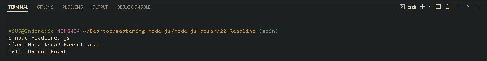

<p align="justify">
Biasanya ketika kita ingin memberikan interaksi kepada pengguna, misalkan menerima dan membaca input dari user, kita dapat menggunakan fitur web API pada JavaScript bernama prompt(), namun seperti yang sudah kita pelajari bahwa teknologi Node JS tidak bisa menjalankan Web API tersebut dan digantikan dengan standard library. Nah standard library yang digunakan untuk menerima dan membaca input dari user tersebut adalah readline.
</p>

```js
import readline from "readline";
import process from "process";

function getInputFromUser() {
  const input = readline.createInterface({
    input: process.stdin,
    output: process.stdout,
  });
  input.question("Siapa Nama Anda? ", function (name) {
    console.info(`Hello ${name}`);
    input.close();
  });
}

getInputFromUser();
```



[<< Process](https://github.com/Bahrul-Rozak/mastering-node-js/tree/main/node-js-dasar/21-Process)
<br>
[Report >>]()
