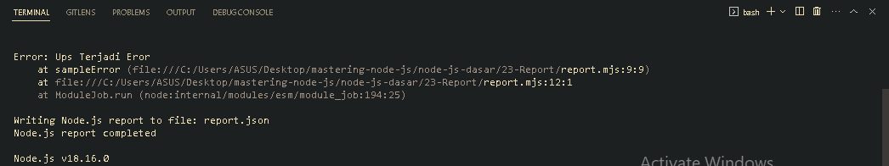
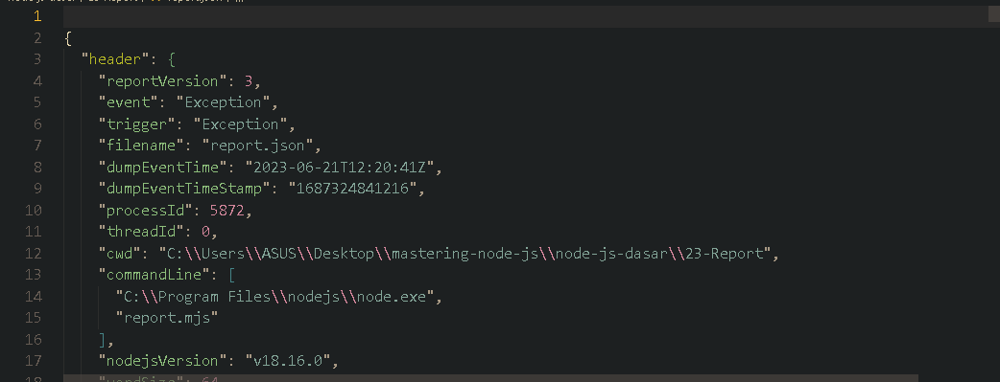

<p align="justify">
Report merupakan fitur yang terdapat di NodeJS untuk membuat laporan secara otomatis dalam file ketika sesuatu terjadi pada aplikasi NodeJS kita. 
</p>

```js
import process from "process";

process.report.reportOnFatalError = true;
process.report.reportOnUncaughtException = true;
process.report.reportOnSignal = true;
process.report.filename = "report.json";

function sampleError() {
  throw new Error("Ups Terjadi Eror");
}

sampleError();
```

<p align="justify">
Maka, kita akan mendapati generate report dalam bentuk file report.json
</p>





[<< Readline](https://github.com/Bahrul-Rozak/mastering-node-js/tree/main/node-js-dasar/22-Readline)
<br>
[Buffer >>]()
