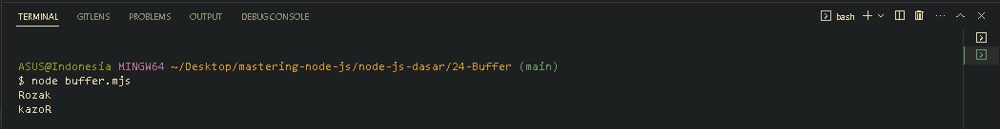

<p align="justify">
Buffer merupakan object yang berisikan urutan byte dengan panjang tetap yang merupakan turunan dari tipe data Uint8Array
</p>

```js
import { Buffer } from "node:buffer";

const buffer = Buffer.from("Rozak");
console.info(buffer.toString());

buffer.reverse();
console.info(buffer.toString());
```



<p align="justify">
Selain itu buffer juga bisa kita gunakan untuk melakukan encoding dan merubah encoding tersebut ke encoding lainnya. Ada banyak encoding yang didukung oleh Buffer, misal utf8, ascii, hex, base64, base64url dan lain-lain.
</p>

```js
import { Buffer } from "node:buffer";

const buffer = Buffer.from("Rozak");
console.info(buffer.toString("base64"));
```

[<< Report](https://github.com/Bahrul-Rozak/mastering-node-js/tree/main/node-js-dasar/23-Report)
<br>
[Stream >>]()
