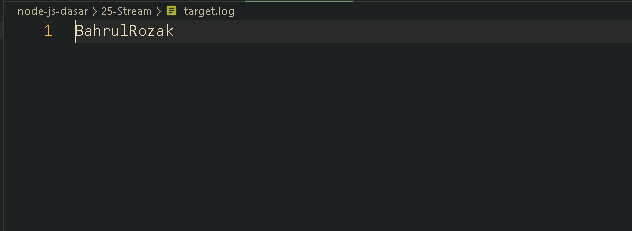

<p align="justify">
Stream adalah standard library untuk kontrak aliran data di teknologi Node JS. Ada banyak sekali Stream object di teknologi NodeJS. Stream bisa jadi object yang bisa dibaca, atau bisa di tulis, dan Stream adalah turunan dari EventEmitter
</p>

```js
import fs from "fs";

function createWriterStream() {
  const writer = fs.createWriteStream("target.log");
  writer.write("Bahrul");
  writer.write("Rozak");
  writer.close();
}

function createReaderStream() {
  const reader = fs.createReadStream("target.log");
  reader.on("data", function (data) {
    console.info(data.toString());
    reader.close();
  });
}

createWriterStream();
createReaderStream();
```

<p align="justify">
Maka kita akan mendapati output target.log
</p>



[<< Buffer](https://github.com/Bahrul-Rozak/mastering-node-js/tree/main/node-js-dasar/24-Buffer)
<br>
[Timer >>]()
