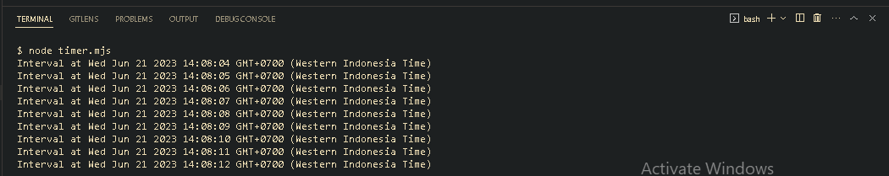
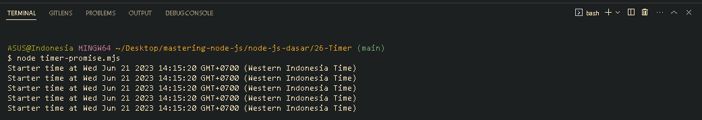

<p align="justify">
Timer merupakan standard library untuk melakukan scheduling. Function di Timer terdapat di globals, seperti yang sudah kita pelajari bahwa function yang terdapat di globals kita bisa menggunakannya tanpa harus melakukan import-import dulu, namun semua function Timer menggunakan mekanisme Callback.
</p>

```js
setInterval(() => {
  console.log(`Interval at ${new Date()}`);
}, 1000);
```



<p align="justify">
Akan tetapi Jika kita ingin menggunakan Timer versi Promise, kita bisa meng-import dari moduletimer/promise
</p>

```js
import timers from "timers/promises";

for await (const startTime of timers.setInterval(1000, new Date())) {
  console.log(`Starter time at ${startTime}`);
}
```



[<< Stream](https://github.com/Bahrul-Rozak/mastering-node-js/tree/main/node-js-dasar/25-Stream)
<br>
[Net >>]()
