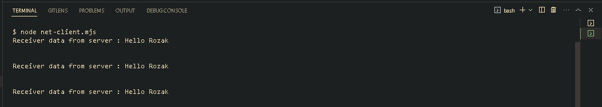
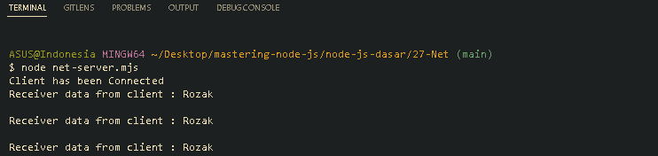

<p align="justify">
Net merupakan standard library yang bisa digunakan untuk membuat network client dan server berbasis TCP atau IPC. Net Server dan Client merupakan object Stream, sehingga kita bisa baca datanya, tulis datanya dan juga menambahkan listener. Pada contoh kali ini kita mempunyai sebuah client server sederhana yang saling terhubung dan akan menerima pesan selama interval yang ditentukan
</p>

```js
// net-client.mjs
import net from "net";

const connection = net.createConnection({
  port: 3000,
  host: "localhost",
});

setInterval(function () {
  connection.write("Rozak\r\n");
}, 2000);

connection.addListener("data", function (data) {
  console.info(`Receiver data from server : ${data.toString()}`);
});
```



```js
// net-server.mjs
import net from "net";

const server = net.createServer(function (client) {
  console.info("Client has been Connected");
  client.on("data", function (data) {
    console.info(`Receiver data from client : ${data.toString()}`);
    client.write(`Hello ${data.toString()}\r\n`);
  });
});

server.listen(3000, "localhost");
```



[<< Timer](https://github.com/Bahrul-Rozak/mastering-node-js/tree/main/node-js-dasar/26-Timer)
<br>
[URL >>]()
