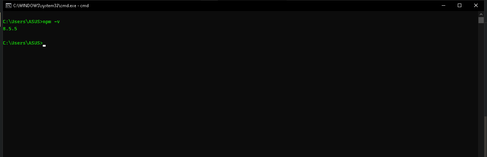

<p align="justify">
Ketika kita membuat aplikasi, aplikasi yang kita deliver kepada client adalah dalam bentuk per project. Dan dalam project tersebut berisi codebase, asset dan masih banyak lagi. Sekilas memang terlihat mudah, namun kita akan mengalami kesulitan, apabila ada beberapa sumber code (source code) yang deprecated. maka kita harus melakukan perbaikan. Bayangkan jika kita menggunakan cara konvensional atau bahasa lainnya manual, maka tentu saja akan merepotkan. Oleh karena itu NPM hadir menjawab permasalahan tersebut. NPM merupakan Node Packet Manager yang digunakan sesuai dengan kepanjangannya yaitu mengatur package. 
</p>


## NPM lebih dari itu!

<p align="justify">
Tidak hanya untuk mengatur package, NPM lebih dari itu. NPM juga bisa digunakan untuk melakukan dependency management (Nanti akan kita bahas di chapter lain) yang kita butuhkan dalam project yang kita buat. Kemudian dengan NPM bisa digunakan untuk download dependency, update dan upgrade dependency secara otomatis, tanpa harus kita lakukan secara manual dengan cara download dependency secara manual seperti yang sudah kita diskusikan dibagian awal.
</p>

## package.json adalah teman kita!

<p align="justify">

Ketika kita bekerja dengan NPM, maka kita akan akrab dengan satu buah file bernama package.json. NPM akan menyimpan semua konfigurasi project di file bernama package.json. Nah Semua konfigurasi project dan juga dependency kita simpan dalam file package.json yang terdapat di dalam directory project. Selain itu kita juga bisa buat file package.json secara manual atau menggunakan auto generate secara otomatis menggunakan NPM.

</p>

## Menginstall NPM

<p align="justify">
Sebenarnya jika kita sudah menginstall Node JS maka secara otomatis node js tersebut sudah terinclude oleh NPM, jadi kita tidak perlu lagi untuk menginstall NPM. Nah untuk memastikannya kita dapat mengexecute perintah

```
npm -v
```

</p>


