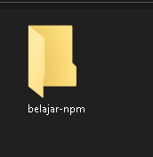

Untuk dapat mengikuti series ini, silahkan anda buat satu buah folder bernama belajar-npm, kemudian letakkan dimanapun sesuka hati Anda.

Kemudian lakukan inisialisasi project tersebut dengan NPM menggunakan perintah npm init.

