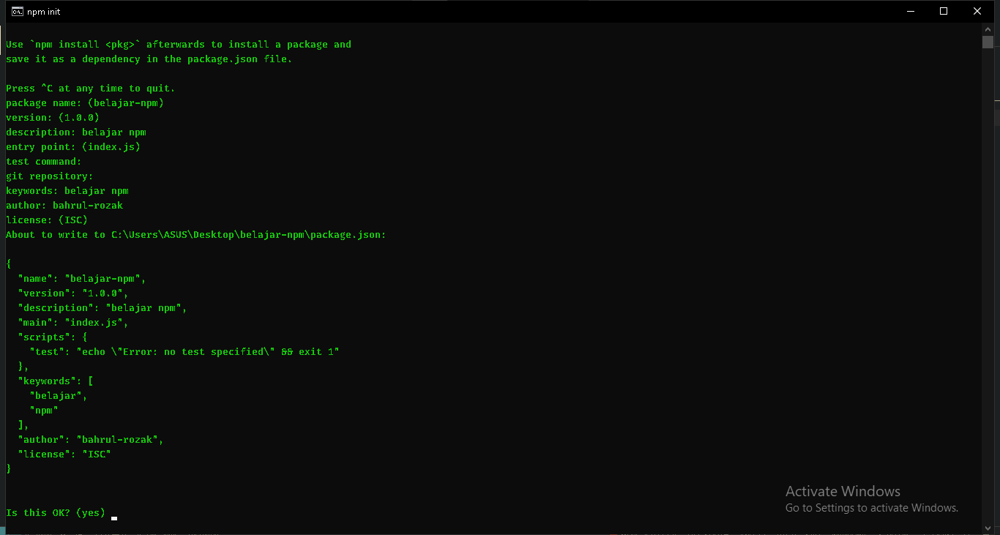
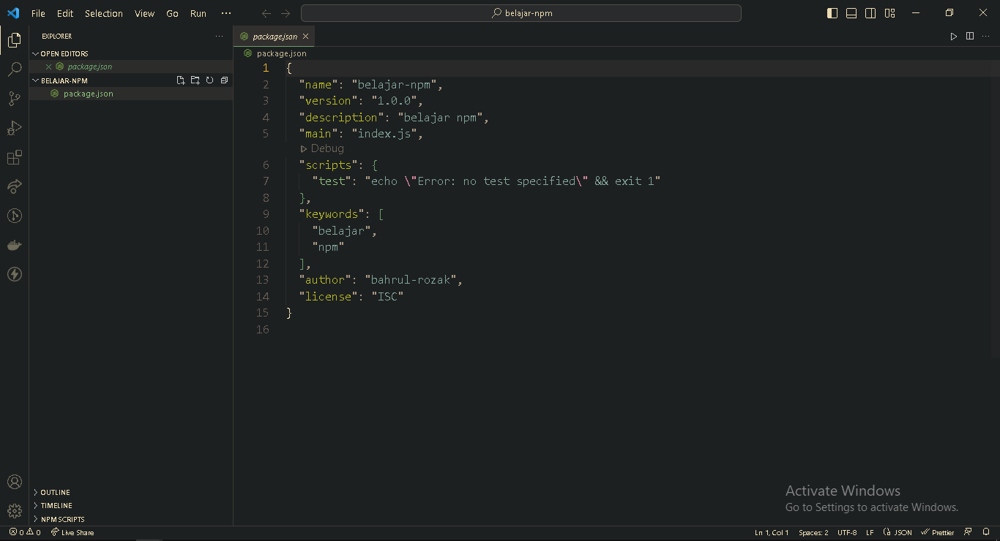

Ketika kita jalankan perintah npm init, pada module sebelumnya maka kita akan mendapati inti dari project yaitu konfigurasi, konfigurasi ini tergenerate secara otomatis dari perintah npm init dalam bentuk file package.json terdiri dari author, version dan lain-lain. Untuk sementara anda bisa isi konfigurasi file package.json seperti ini

Maka seperti inilah isi dari file package.json

