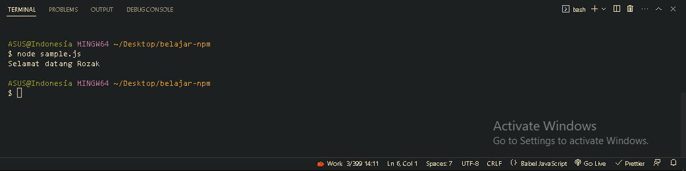

<p align="justify">
Untuk menjalankan project, sebenarnya caranya sama seperti kita menjalankan file dengan Node JS Kita bisa gunakan perintah node namaFile. Akan tetapi yang membedakan adalah Node JS sebelum menjalankan file nya, dia akan membaca konfigurasi dari package.json terlebih dahulu
</p>

```js
function Sample(name) {
  console.log(`Selamat datang ${name}`);
}

const sample = new Sample("Rozak");
```


