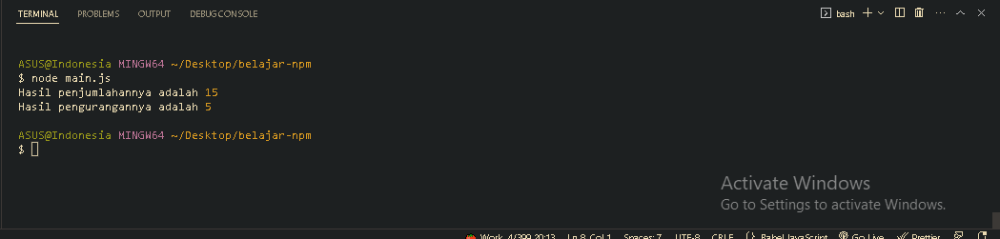

<p align="justify">
Secara default, saat kita membuat project Node JS, Node JS menggunakan commonjs. Oleh karena itu, ketika kita ingin menggunakan JavaScript Modules, kita harus mengubah file nya menjadi file mjs (.mjs). Namun, kita juga bisa mengubah default project type dari commonjs menjadi js modules, dengan cara mengubah type di package.json. Hal ini sangat direkomendasikan karena sekarang kita pasti akan sering menggunakan js modules dibandingkan  commonjs, karena js modules sudah menjadi standard di JavaScript.
</p>

```json
// package.json
{
  "name": "belajar-npm",
  "version": "1.0.0",
  "description": "belajar npm",
  "main": "index.js",
  "scripts": {
    "test": "echo \"Error: no test specified\" && exit 1"
  },
  "keywords": ["belajar", "npm"],
  "author": "bahrul-rozak",
  "license": "ISC",
  "type": "module"
}
```

<p align="justify">
Sebagai contoh disini kita akan membuat JS module yang memiliki fungsi untuk melakukan operasi penjumlahan dan pengurangan dan akan kita import fungsi tersebut pada entry point, dalam hal ini adalah main.js
</p>

```js
// math.js
const addition = (a, b) => {
  return a + b;
};

const subtraction = (a, b) => {
  return a - b;
};

export { addition, subtraction };
```

```js
// main.js
import { addition, subtraction } from "./math.js";

const additionResult = addition(10, 5);
console.log(`Hasil penjumlahannya adalah`, additionResult);

const subtractionResult = subtraction(10, 5);
console.log(`Hasil pengurangannya adalah`, subtractionResult);
```

<p align="justify">
Maka berhasil :D
</p>


